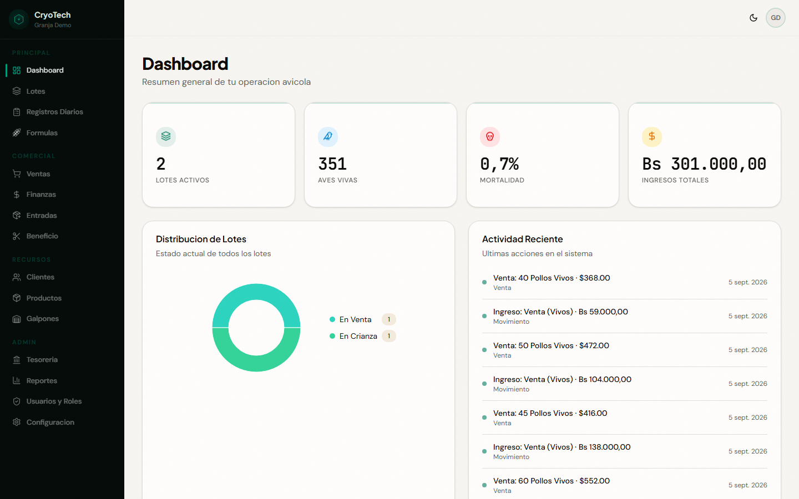
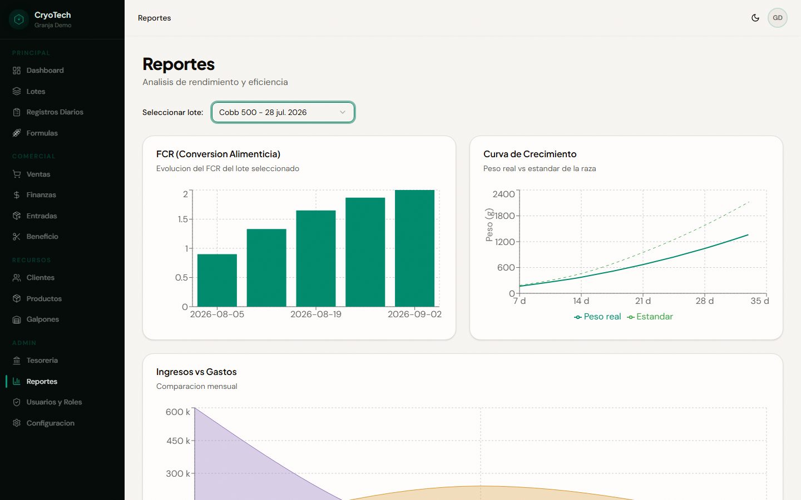
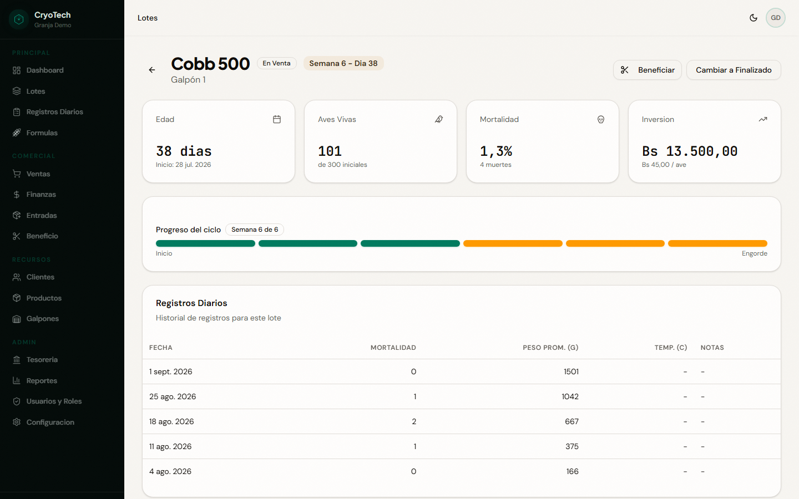
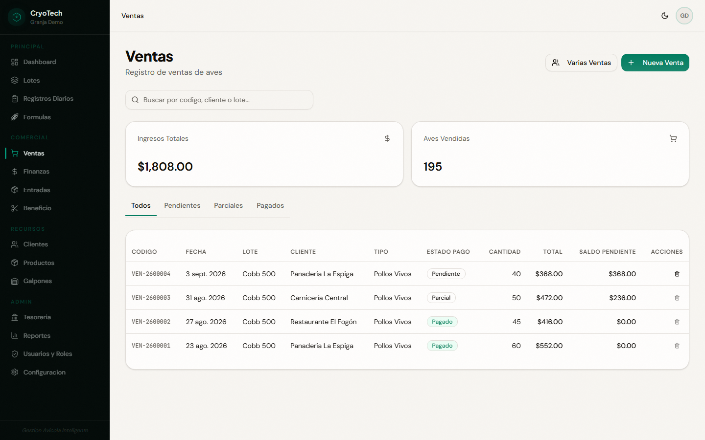
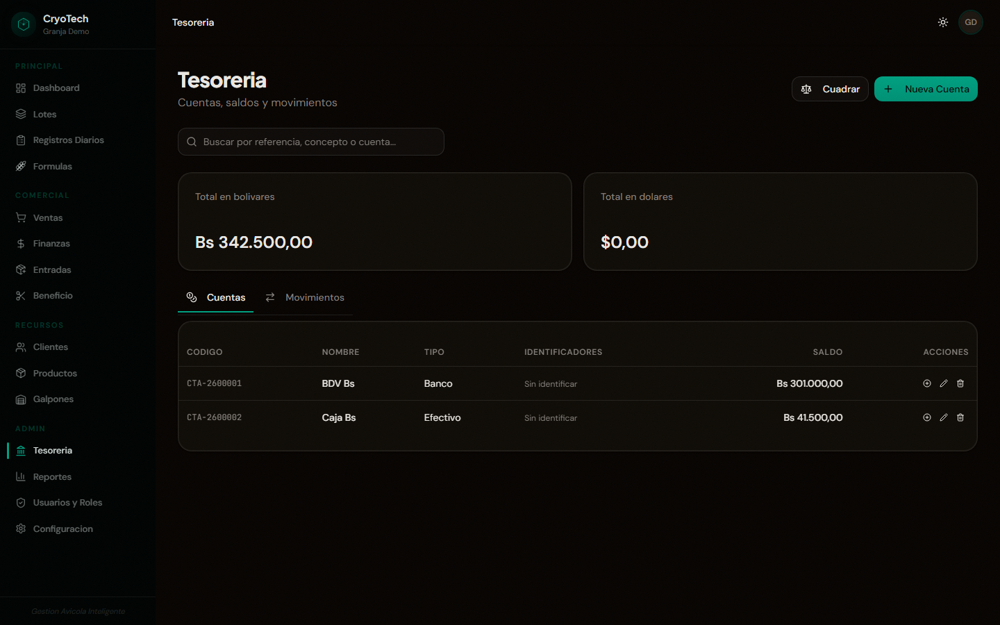

# CryoTech

Poultry management for small producers: batch tracking, costs, dual-currency
treasury, and a conversational assistant that records operations from Telegram
or WhatsApp by reading photos of bank receipts.

This is not an exercise project. It runs a real farm in Venezuela, and much of
its design comes from mistakes that cost money: there are comments in the code
that say exactly what went out of balance and why the fix has the shape it has.



<table>
  <tr>
    <td width="50%"></td>
    <td width="50%"></td>
  </tr>
  <tr>
    <td></td>
    <td></td>
  </tr>
</table>

> Real screenshots of the application, over a demo farm seeded by
> `apps/web/scripts/screenshots.mjs`. None is a mockup and none comes from the
> real farm's data. The interface is in Spanish because that is the language of
> the people who use it.

---

## The problem

A small producer keeps the books in a notebook or in WhatsApp. That fails in
three concrete places:

1. **Two currencies.** Supplies are bought in dollars, sales are collected in
   bolivares, and the official BCV rate moves daily. Without recording the rate
   of each operation, the margin is a guess.
2. **The real cost of a batch is invisible.** Feed, vaccines, chicks, mortality
   and slaughter are paid at different moments; nobody adds them up per batch.
3. **Recording cannot be work.** If writing down a sale means opening an app,
   the sale does not get written down. That is why the main way in is a chat:
   you send a photo of the receipt and the system proposes the entry.

---

## What it does

| Area | Scope |
|------|-------|
| **Batches** | `planned → breeding → for_sale → finished` lifecycle, daily log of feed, mortality and weight |
| **Metrics** | FCR, mortality %, growth curve against the breed standard, cost per bird |
| **Sales** | Live and processed birds, cash and credit sales, partial collections |
| **Treasury** | Multi-currency accounts, movements reconciled against receipts |
| **Purchases** | Supply entries and accounts payable |
| **Assistant** | Telegram and WhatsApp bot: records sales, collections and expenses by conversation |
| **Receipts** | Reads transfer screenshots, detects which way the money went and proposes the entry |
| **Multi-company** | Several companies per user, with roles and per-module permissions |

---

## Stack

| Layer | Technology |
|-------|-----------|
| Monorepo | pnpm workspaces + Turborepo |
| Backend | NestJS 11, Prisma 6, PostgreSQL 16 |
| Frontend | React 19 + Vite (SPA), Tailwind v4, Shadcn/UI, TanStack Query v5 |
| Types | TypeScript strict, Zod shared between client and server |
| Auth | Own JWT (`@nestjs/jwt` + Passport), no external provider |
| Bot | Telegram Bot API · WhatsApp Cloud API through a Cloudflare Worker + D1 |
| OCR / AI | Tesseract.js, with the Anthropic API as a fallback |
| Infra | API on Render (Docker) · Postgres on Neon · Worker on Cloudflare |

---

## Architecture

```
cryotech/
├── apps/
│   ├── api/                    # NestJS — one module per business aggregate
│   │   ├── prisma/             # Schema + hand-written SQL migrations
│   │   └── src/
│   │       ├── common/         # guards, decorators, pipes, filters
│   │       └── modules/
│   │           ├── assistant/  # Bot core, channel-agnostic
│   │           │   └── inbound/# Envelope, idempotency, allowlist
│   │           ├── telegram/   # Telegram transport (direct webhook)
│   │           ├── whatsapp/   # Meta transport (buffer poller)
│   │           └── receipt-ocr/# Receipt reading
│   └── web/                    # React + Vite SPA + Playwright
├── packages/
│   └── shared-types/           # Zod schemas: one definition, two sides
└── services/
    ├── webhook-buffer/         # Cloudflare Worker + D1: inbound queue
    └── whatsapp-flows/         # Meta's native forms
```

### Decisions worth a look

**Two channels, one assistant.** `assistant/` imports no transport.
`assistant/inbound/` defines an `InboundEnvelope` each transport builds and a
`ChannelSender` it registers on boot. Idempotency, the allowlist, dispatch by
message type and receipt grouping live exactly once. Adding a channel is
writing a translator.

**The Worker only in front of WhatsApp.** Meta demands an HTTPS endpoint that
answers in seconds and validates an HMAC signature over the raw body. The
Worker receives, verifies and queues into D1; the API *pulls* from that queue.
Telegram needs none of it: it authenticates with a header secret and holds
undelivered updates for 24 h, so it delivers straight. Two channels, two
topologies, for different reasons.

**Receipt reading in tiers.** Tesseract locally first, with a parser anchored to
the printed captions (`Fecha:`, `Operación:`, `Origen:`) rather than to
coordinates — it survives the redesigns of banking apps. Only when fields are
missing does it escalate to Anthropic's model. The expensive tier is paid for
when it is needed, not always.

**The parser would rather stay quiet than guess.** A caption it does not
recognise yields an empty field, never a supposition: an empty field gets asked
about, a wrong one gets confirmed without looking. The same logic is in
`parseAmount`, which decides the decimal separator by whichever appears last —
reading `2.450,00` as `2.45` under-records a payment by three orders of
magnitude.

**Multi-tenancy without RLS.** The tenant is the company. There is no Supabase:
the API talks to Postgres through Prisma with a single database role, so
isolation lives in the application. `CompanyMembershipGuard` validates the
membership behind `X-Company-Id` before letting a request through, and every
service filters by `companyId`. That filter is the only isolation there is:
omitting it is a leak. A dedicated suite (`check-tenancy.ts`) creates two
companies from scratch and verifies neither sees the other.

**Refresh token rotation with families.** 256 random bits, stored hashed with
SHA-256. Reusing an already-rotated token revokes the whole family, which is the
signal that someone copied one.

**The rate is scraped from the BCV, not from a third-party API.** The public
APIs lagged by up to 5 Bs/USD, and that is a real loss on every sale. The scrape
goes through a proxy on the Worker because Node cannot verify the BCV's
certificate chain, and the flag that allowed it is forbidden in production.

---

## Getting started

**Requirements:** Node 22, pnpm 9.15, Docker. The `Makefile` also uses `make`
and `lsof`, which Windows does not ship — the no-`make` path is below.

```bash
pnpm install

# Two env files, and both are needed locally:
cp .env.example .env                     # read by docker-compose (Postgres)
cp apps/api/.env.example apps/api/.env   # read by Nest, the Makefile and the scripts
chmod 600 .env apps/api/.env             # fill both in; see the comments

make setup                               # Postgres, types and migrations
make dev                                 # API on :3011 · Web on :3002
```

Two files is not an oversight: the root one describes the stack Compose brings
up on a server, and the `apps/api/` one the process running on your machine
against that Compose database. Both are commented variable by variable.

Two things that cost an afternoon if nobody warns you: **Postgres is published
on 5434**, not 5432, so it does not clash with an existing install; and the boot
**rejects the example secrets** as well as short ones, so they have to be
generated for real with `openssl rand -base64 48` (`src/config/env.schema.ts`).

`make help` lists the rest of the targets.

### Without `make` (Windows)

The targets do no magic; they are these same commands. In PowerShell or Git
Bash, after copying and filling in both `.env` files:

```bash
docker compose up -d --wait postgres              # Postgres on 127.0.0.1:5434
pnpm --filter @cryotech/shared-types build
pnpm --filter @cryotech/api exec prisma generate
pnpm --filter @cryotech/api exec prisma migrate deploy

pnpm --filter @cryotech/api exec nest start --watch   # API  :3011
pnpm --filter @cryotech/web exec vite                 # Web  :3002
```

To stop the API or the web, `Ctrl-C` in their terminal: `make stop` uses `lsof`,
which is Unix-only. If `pnpm` is not on the PATH, `corepack pnpm …` works with
nothing to install.

---

## Commands

```bash
# Quality
pnpm type-check                 # TypeScript across the monorepo
pnpm lint                       # ESLint (flat config at the root)
pnpm test                       # Vitest: unit, no database
pnpm audit --audit-level=high

# Database
pnpm db:generate                # Prisma client
pnpm db:studio
pnpm --filter @cryotech/api exec prisma migrate deploy

# Tests that need the API running
scripts/check-api.sh            # API verification suites
pnpm e2e                        # Playwright
services/webhook-buffer/scripts/check-worker.sh

# README screenshots (seeds a demo farm and photographs it)
node apps/web/scripts/screenshots.mjs
```

> The shell helpers in `scripts/` and `services/*/scripts/` use `python3` to
> read JSON. `scripts/check-api.sh` and everything under it do not: Node only.

> Against real data always `migrate deploy` over a hand-written migration.
> `migrate dev` can reset the schema if it detects drift.

---

## Tests

Three levels, with one rule that was expensive to learn: **the suites never run
against the real company.** Each one creates and reuses `ZZ Empresa de Pruebas`.
Running them against the real data pushed the sales numbering fifty numbers
ahead and threw the inventory out; the comment explaining it is still in
`check-api.sh` on purpose.

- **76 unit tests** with Vitest (`pnpm test`), over what can be tested without a
  database or a browser: the receipt parser, the batch metrics, the fuzzy client
  search and the narrowing of enums coming from the URL. These are the ones that
  run on every PR.
- **14 verification scripts** (`apps/api/scripts/check-*`) that exercise the API
  through its services: treasury, payables and receivables, isolation between
  companies, the assistant queue, receipt reading, the bot's whole flow.
  `scripts/check-api.sh` runs 11 of them — 418 checks — and the other three are
  launched separately because they need more than the local API (a `wrangler
  dev`, or the Telegram webhook published).
- **82 Playwright tests** across 18 files (`apps/web/e2e/`), including
  `security.spec.ts`, which checks that a user from another company cannot reach
  data that is not theirs.

What needs neither network nor database — types, lint and unit — runs on every
PR; the rest is launched by hand against a running environment. `check-flows`
skips its steps 3 to 8 on its own when no form is published on Meta: that is an
environment condition, not a failure.

The receipts in `apps/api/test/fixtures/` are synthetic images: they replicate
the layout of a BDV transfer, with invented names, references and account
numbers (the amounts and dates do come from the original screenshots). Their
identifiers have to match those of the account in `scripts/lib/test-company.ts`
— change one, change the other.

---

## Security

A summary; the detail is in [`AGENTS.md`](AGENTS.md).

- The three guards in mandatory order: `JwtAuthGuard` →
  `CompanyMembershipGuard` → `PermissionGuard`. Permissions enumerated per
  module and action, with no wildcard.
- bcrypt cost 12. Access token 15 min, refresh 7 days with rotation by family.
- Global rate limiting (120/min) and 5 attempts / 15 min on login and register.
- Zod on both sides; every `@Body()` goes through `ZodValidationPipe`. The
  exception is the Telegram webhook, which validates with `safeParse()` by hand
  so it can answer 200 to a payload it does not recognise: on a 400, Telegram
  retries the same update forever.
- `helmet` on the API; CSP, HSTS and `X-Frame-Options` in `nginx.conf`.
- Exact-origin CORS, validated on boot. No wildcards.
- Public sign-up is closed in production by default: it is the only route that
  creates users with no prior credentials.
- Webhooks: Meta's HMAC signature verified in constant time on the Worker;
  Telegram's header secret compared, also in constant time. With no secret
  configured, 403 to everything.
- Who may talk to the bot is an allowlist per channel. An unknown sender gets no
  answer — silence does not confirm the account exists.
- CI on every PR: `pnpm audit`, gitleaks over the whole history, type-check,
  lint and the unit tests.
- No secrets in the repository. `render.yaml` declares the variables with
  `sync: false` or `generateValue: true`, so the values never pass through git.

---

## Status

Running in production for one farm, with the API on Render and the Telegram bot
live.

What is **not** done, so there are no surprises:

- **PWA / offline.** Designed and documented, but not implemented: there is no
  service worker and no query persistence. Today the web needs a connection.
- **WhatsApp with native forms.** The code is there and turns on with
  `WHATSAPP_FLOWS_ENABLED`, but Meta does not release Flows to a business
  without legal registration, so in practice the live channel is Telegram.
- **The web is not deployed.** Only the API. The frontend runs locally.

---

## License

MIT — see [LICENSE](LICENSE).
